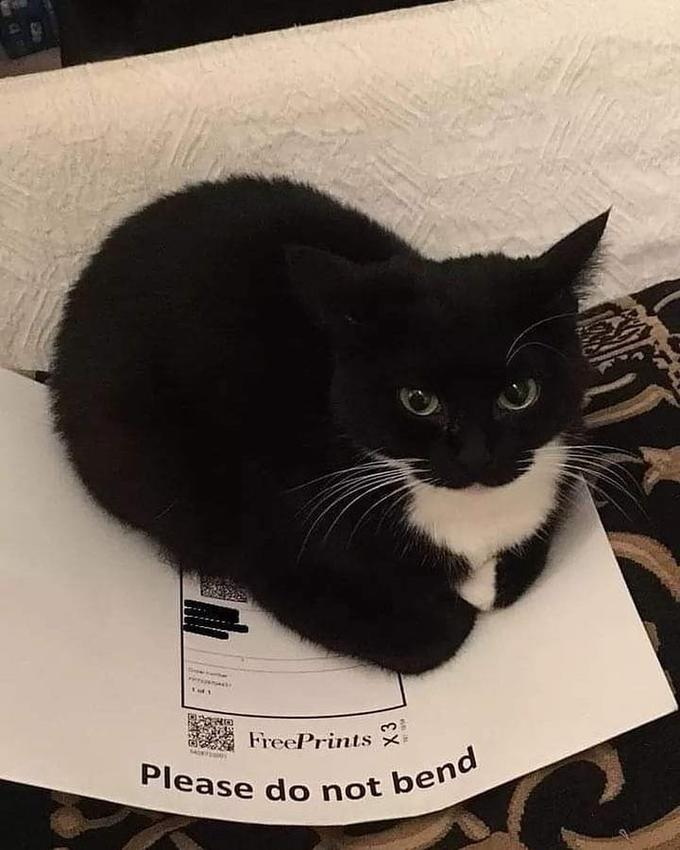

# Maxwell

Open-source Maxwell the Cat information (originally named "dingus")

## Where does maxwell originate?

from an image of a meme where a cat is depicted bending a package that says "please do not bend":

## Where can I find the files for maxwell myself?

(This assumes you have the popular addon, Maxwell the Carryable Cat, installed)

- `carryable cat.gma` is located in `C:\Program Files (x86)\Steam\steamapps\workshop\content\4000\2878054450`
